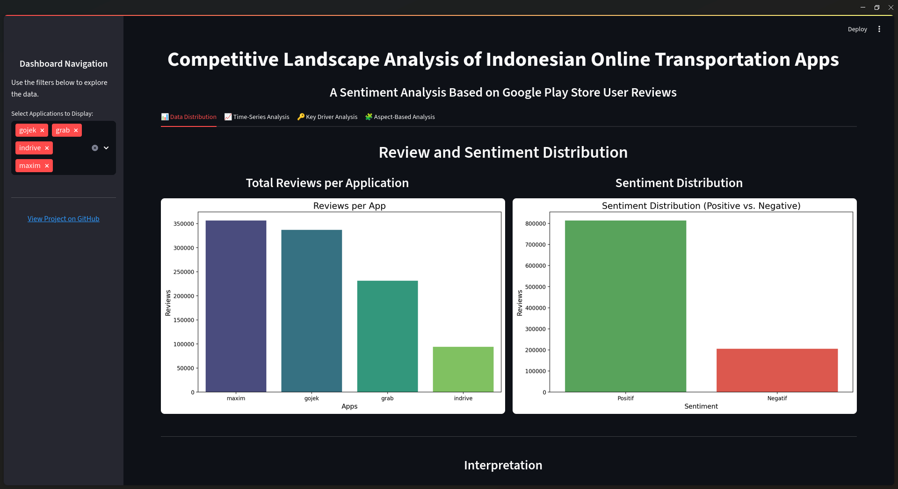
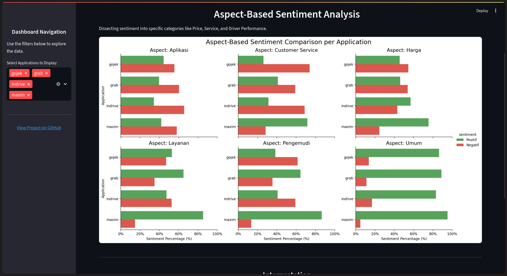

# Competitive Landscape Analysis of Indonesian Online Transportation Apps Through Google Play Store Reviews


 


## Project Overview

This project presents an in-depth sentiment analysis of the leading ride-hailing applications in Indonesia: **Gojek, Grab, Maxim, and inDrive**. By leveraging a massive dataset of over 1 million user reviews from the Google Play Store (spanning from 2022 to 2025), this analysis aims to uncover the public's perception, identify key drivers of customer satisfaction and dissatisfaction, and map out the competitive landscape of this dynamic market.

The primary goal is to move beyond simple sentiment classification and extract actionable business insights through various analytical techniques, which are presented in both a Jupyter Notebook and an interactive Streamlit dashboard.

---

## 🚀 Interactive Dashboard

To make the findings of this analysis more accessible and explorable, an interactive web dashboard has been developed using Streamlit. You can interact with the charts, filter by application, and explore the data yourself.

**[➡️ Click here to access the live dashboard](https://indonesian-online-transportation.streamlit.app/)**


 

---

## Key Questions

This analysis seeks to answer several critical business questions:
1.  Which application holds the most positive sentiment among Android users in Indonesia?
2.  How has user sentiment for each brand evolved over the past few years?
3.  What are the main drivers of positive sentiment (strengths) and negative sentiment (weaknesses) for each application?
4.  How do the applications compare across key business aspects such as **Price, Service Quality, Driver Performance, and Application Usability**?

---

## Dataset

* **Source:** Google Play Store
* **Applications Analyzed:** Gojek, Grab, Maxim, inDrive
* **Total Reviews:** ~1 million
* **Time Range:** January 2022 - June 2025
* **Language:** Indonesian

---

## Methodology & Workflow

This project follows a structured, end-to-end data analysis workflow:

1.  **Data Collection:** Scraped over 1 million user reviews for the four target applications using the `google-play-scraper` library.
2.  **Data Preprocessing & Cleaning:** Performed extensive text cleaning, including slang normalization and stopword removal.
3.  **Exploratory Data Analysis (EDA):** Investigated the dataset to uncover initial patterns through distribution, sentiment, and time-series analysis.
4.  **Sentiment Classification Modeling:** Built a baseline classification model using a **TF-IDF Vectorizer** and **Logistic Regression** pipeline, achieving a robust **accuracy of 93%**.
5.  **In-depth Analysis:**
    * **Feature Importance Analysis:** Extracted the most influential keywords for each app.
    * **Aspect-Based Sentiment Analysis (ABSA):** Categorized reviews into key business aspects to perform a granular, head-to-head comparison.
6.  **Dashboard Development:** Created an interactive dashboard with **Streamlit** and **Plotly** to present the findings in an accessible way.

---

## Key Findings & Insights

| Application | Top Strength(s) | Top Weakness(es) |
| :--- | :--- | :--- |
| **Gojek** | **Functionality & Utility** | **Application Performance** & **Customer Service** |
| **Grab** | **Service Reliability** & emotional appreciation | **Price Perception** & **Customer Service** |
| **Maxim** | **Price (Affordability)** & **Driver Conduct** | Relatively few weaknesses. |
| **inDrive** | **Price (Affordability)** | **Driver Conduct** & **Customer Service** |

---

## Tools and Libraries

* **Data Manipulation & Analysis:** Pandas, NumPy
* **Data Visualization:** Matplotlib, Seaborn, **Plotly**
* **Interactive Dashboard:** **Streamlit**
* **Machine Learning & NLP:** Scikit-learn, NLTK
* **Data Collection:** google-play-scraper
* **Development Environment:** Jupyter Notebook

---

## How to Run This Project

This project can be explored in several ways:

### Option 1: View the Interactive Dashboard (Recommended)
The easiest way to explore the project's findings is through the live Streamlit dashboard.

**[➡️ Click here to access the live dashboard](https://indonesian-online-transportation.streamlit.app/)**


### Option 2: Run the Streamlit App Locally
To run the interactive dashboard on your own machine.

1.  **Clone the repository:**
    ```bash
    git clone [https://github.com/Fakur19/indonesian-online-transportation-sentiment-analysis.git](https://github.com/Fakur19/indonesian-online-transportation-sentiment-analysis.git)
    cd indonesian-online-transportation-sentiment-analysis
    ```
2.  **Set up a virtual environment:**
    ```bash
    python -m venv venv
    source venv/bin/activate  # On Windows, use `venv\Scripts\activate`
    ```
3.  **Install the required libraries:**
    ```bash
    pip install -r requirements.txt
    ```
4.  **Run the data preprocessing script** (this only needs to be done once to generate the necessary files for the app):
    ```bash
    python preprocess_for_streamlit.py
    ```
5.  **Launch the Streamlit app:**
    ```bash
    streamlit run app.py
    ```

### Option 3: Run the Analysis Notebook
This method allows you to review the code and analysis steps using the provided sample dataset.

1.  Follow steps 1-3 from Option 2.
2.  Launch Jupyter: `jupyter notebook`
3.  Open the main analysis notebook (e.g., `sentiment-analysis.ipynb`) and run the cells.

---

## Future Work

-   **Expand Data Sources:** Incorporate reviews from the Apple App Store.
-   **Advanced Modeling:** Implement NLP models like IndoBERT for more nuanced insights.
-   **Topic Modeling:** Apply techniques like LDA to automatically discover hidden topics.

